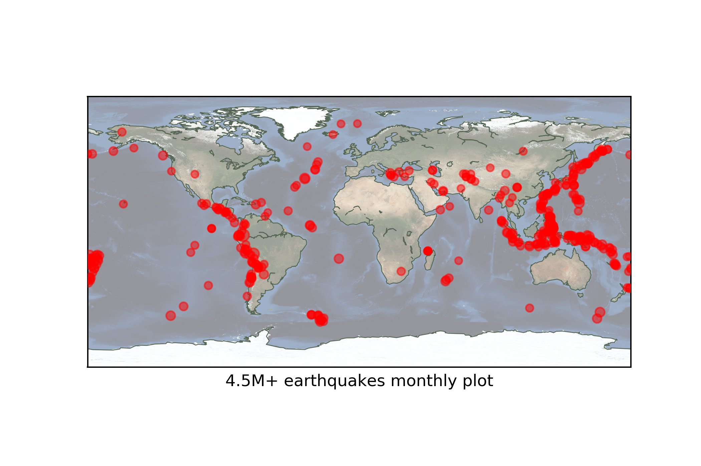

# quakes

Mapping earthquakes data in Python 3.x using matplotlib’s basemap. Example of Geographical Plotting using real time data.

The dataset is available at [USGS Earthquake Hazards Program](https://earthquake.usgs.gov/earthquakes/feed/v1.0/csv.php). 

There are 4 types of data available, depending upon the time. And in each type, there are 4 sub-types, depending upon the ritcher magnitude scale.

This analysis is done using the [past month M4.5+](https://earthquake.usgs.gov/earthquakes/feed/v1.0/summary/4.5_month.csv) data.

### Plot

### Steps
The analysis is of two steps:
1. Downloading and parsing the USGS earthquake data.
2. Rendering the map and data.

A detailed explanation will be given in a blog post (later).

### Tools 
- [Anaconda](https://docs.anaconda.com/)
- [pandas](https://github.com/pandas-dev/pandas)
- [basemap](https://github.com/matplotlib/basemap)

### References
- http://www.labri.fr/perso/nrougier/teaching/matplotlib/
- http://introtopython.org/visualization_earthquakes.html
